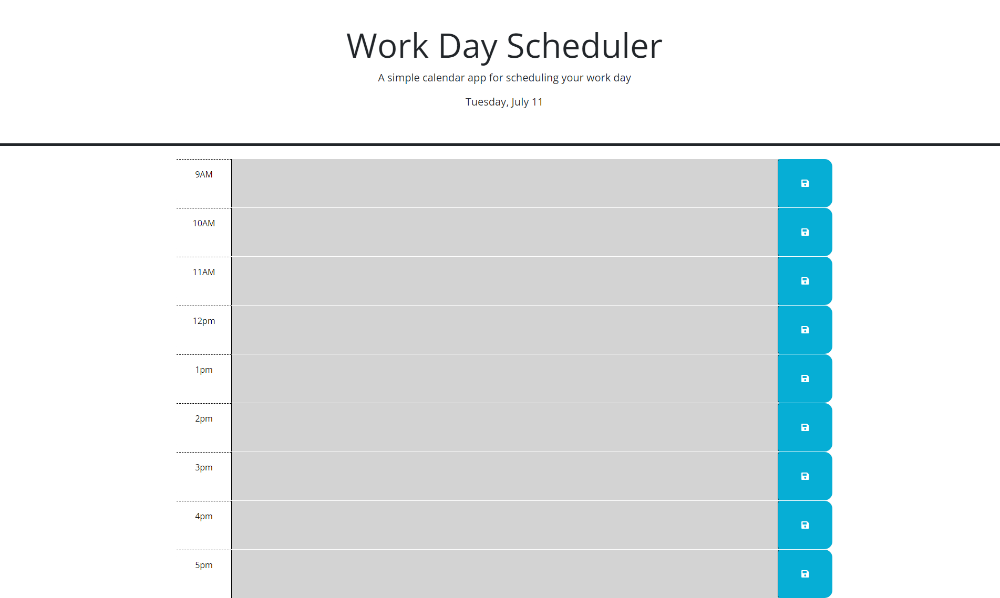

# Work Schedule

## Description
Here is my work scheduler. In this assignment, the instructions were to make the page responsive using JQuerry. The page is able to plan out your work day and log it into the local storage and post it to the page. The page is helpful for keeping your daily life up to date and making sure all your tasks are complete throughout the day.
## Instalization
N/A

## Usage
[Click here to see the final product](https://crandonbruz.github.io/daily-schedule/)

## Credits

## License
[MIT](https://choosealicense.com/licenses/mit/)
